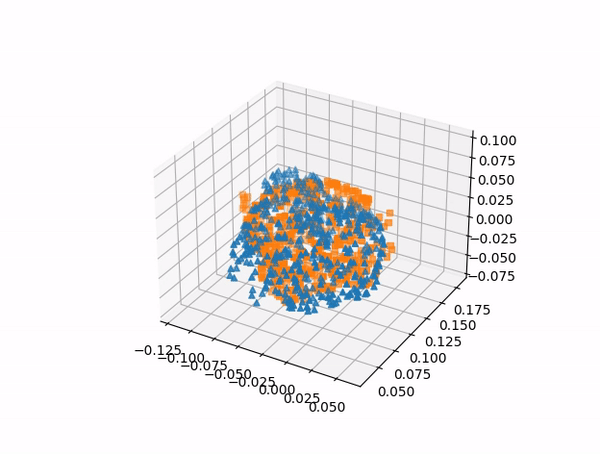

This repository is a python implementation of dual quaternion Kalman filter based on the following works:

1. [Novel quaternion Kalman filter](https://ieeexplore.ieee.org/document/1603413)
2. [Active Visuo-Tactile Point Cloud Registration for Accurate Pose Estimation of Objects in an Unknown Workspace](https://ieeexplore.ieee.org/abstract/document/9636877)
3. [Active Visuo-Tactile Interactive Robotic Perception for Accurate Object Pose Estimation in Dense Clutter](https://ieeexplore.ieee.org/abstract/document/9709520)
4. [Estimating SE(3) elements using a dual quaternion based linear Kalman filter](http://www.roboticsproceedings.org/rss12/p13.pdf)

The bunny mesh model is from [the Standford 3D Scanning Repository](http://graphics.stanford.edu/data/3Dscanrep/).

Visualization of the estimation
